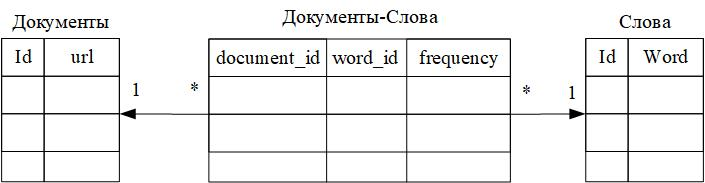

# Описание работы основного кода в main

Для запуска рабочей программы закоментируйте #define OLD_DEBUG в файле "globals.h".
1. Запустите программу. 
2. Откройте файл "startPage.html". При открытии файла, скрипт запретит водить данные на протяжении первых 10 секунд.
3. Введите слово/ слово сочетания в тег input, нажмите кнопку "Отправить".
4. 
# Рекомендация по проверки работы
В файле "globals.h" лежат #define при комментировании/раскоментировании которых можно проверить работу соответсвующих классов.

*DEBUG_PRINT_DATA* - определяет печатать ли отладочную информацию.

*MAX_NUMBER_OF_LINKS_ON_ONE_PAGE* - Определяет число ссылок анализируемых на одном сайте. Если закомендировать данный define то будут анализироваться все ссылки на сайте.

*OLD_DEBUG* определяет режим отладки. Если закоментирован то режим отладки выключен, иначе включен.

Каждый клас имеет свой define для отладки:

*DEBUG_INDEXER* - для проверки работы класса [Indexer](#Индексация)

*DEBUG_DATABASE* - для проверки работы класса [Database](#База-данных)

*DEBUG_HTTPCLIENT* - для проверки HTTP клиента [HTTPClientSinc](#HTTP-клиент)

*DEBUG_SPIDER* - для провекри работы работы класса [Spider](#Паук)

*DEBUG_THREAD_POOL* - для полной провекри работы клиента [Thread_pool](#Пул-потоков)

*DEBUG_HTTP_SERVER* - для проверки работы сервера [handle_client_http_](#Сервер)

*DEBUG_WORD_SEARCH_ENGINE_DATA_BASE* - для проверки работы поисковика слов в БД [WordSearchEngineDatabase](#Класс-для-анализа-частоты-слов-в-БД)

# Индексация
Для работы с индексацией применяется класс Indexer, пространства имен SPIDER.

Класс Indexer имеет следующие поля:
| Имя поля           | Тип значений | Комментарий|
|--------------------|--------------|------------|
| wordFrequency_     | map<std::string, int> | Определяет число повторений слов на странице|
| originPageHTML_    | std::string           | Содержит оригенальный текст страницы без HTML тегов|
| formattedPageHTML_ | std::string           | Содержит отформитированный текст страницы   |
| html_              | std::string           | Содержит текст страницы страницы|
| url_               | std::string           | Содержит ссылку на текущую страницу|
| cleaningHTMLTags_  | CleaningHTMLTags      | Предоставляет интерфейс для очистки HTML документа от тегов, смотри описание класса [CleaningHTMLTags](#Класс-для-очистки-тегов)|
| linksOnTheCurrentSite| std::vector         | Содержит url страниц найденных на данном сайте|
| linksOnTheCurrentSiteLink| std::vector<Link>         | Содержит ссылки [Link](#Структура-ссылок) страниц найденных на данном сайте|
| currentLink          | Link         | Ссылка [Link](#Структура-ссылок) на текущую страницу |
| database_          | Database         | Поле типа [Database](#База-данных)|

Класс Indexer имеет следующие методы: 
| Имя метода                | Тип принимаемого/возвращаемого значения | Комментарий|
|---------------------------|-----------------------------------------|------------|
| pageRequestHTML           | std::string / void | Открывает файл HTML, и удаляет все теги|
| convertWordsLowerCase     | void / void        | Приводит текст к нижнему регистру|
| wordFrequencyAnalysisText | void / void        | Заполняет wordFrequency_ |
| saveDataDatabase          | void / void        | Сохраняет данные в таблицу|
| setData                   | void / void        | Сохраняет данные в таблицу, однако вероятно этот метод будет выполнятся асинхронно|
| **execute**               | const std::string& URL, const std::string& html / void | Основной метод. Имено его нужно вызвать что бы началась работа класса, он сформирует wordFrequency_ и linksOnTheCurrentSite, а так же сохраняет данные в БД, URL - ссылка на страницу, html - текст страницы|
| **execute**  | const Link& link, const std::string& html / void | Основной метод. Имено его нужно вызвать что бы началась работа класса, он сформирует wordFrequency_ и linksOnTheCurrentSite, а так же сохраняет данные в БД, URL - ссылка на страницу, html - текст страницы|
| getLinksOnTheCurrentSite  | void / std::vector | Возвращает вектор ссылок найденных на текущем сайте|
| getLinksOnTheCurrentSiteLink  | void / std::vector<Link> | Возвращает вектор ссылок [Link](#Структура-ссылок) найденных на текущем сайте|
| urlIsNotImage             | const std::string& line / bool | Проверяет является ли url ссылкой на картинку, возвращает true если является, иначе false|

## Класс для очистки тегов
Класс **CleaningHTMLTags** предназначен для очистки файла от тегов. Основные методы:

 **std::string execute(const std::string& input)**, который возвращает отформитированную строку, а в качестве параметра получает строку.

 **std::string getURL(const std::string& html)**, который очищает строку от тегов и в случае если есть ссылка возвращает ее, в противном случае возвращает "".
В констрeкторе можно переопределить регулярное выражение по которому очищается файл от тегов. Для этого необходимо переопределить регулярное выражение **tags** - для очистки тегов, **hrefTegs** - для очистки ссылок.

## Структура ссылок
Для быстрой обработки ссылок, веделения хоста и таргета, а так же хранения текущего уровня рекурсии применяется струтктура Link.

**Поля**
| Имя поля           | Тип значений | Комментарий|
|--------------------|--------------|------------|
| url_               | std::string  | Полное значение ссылки|
| host_              | std::string  | Хост ссылки|
| target_            | std::string  | Таргет ссылки   |
| currentRecursionLevel_ | int      | Текущий уровень рекурсии ссылки  |

**В конструктор структуры необходимо передать полное значение ссылки и текущий уровень рекурсии.**

# База данных
## Структура для инициализации данных для подключения к БД
В пространсте имен SPIDER имеется структура BDSetup, которая в коснтруктор принимает ini файл (ini.txt), и считывает:
1. Хост (адрес) базы данных;
2. Порт, на котором запущена база данных;
3. Название базы данных;
4. Имя пользователя для подключения к базе данных;
5. Пароль пользователя для подключения к базе данных;

Данная структура предназначена только для считывание ини файла. Единственно публичное поле данной структуры **std::string dataSetup_** , которое предназначено для передачи его в конструктор класса **Database**

## Создание базы данных
Структура базы данных для обработки полученных слов имеет следующий вид:

Структура БД

Класс **Database** предназначн для работы с БД он имеет следующие методы:

**Публичные методы**:
| Имя метода                | Тип принимаемого/возвращаемого значения | Комментарий|
|---------------------------|-----------------------------------------|------------|
| Database                  | std::string / void | Конструктор, принимает данные считынные с ini файла с помощью структуры [BDSetup](#Структура-для-инициализации-данных-для-подключения-к-БД)|
| createTables              | void / void        | Создается таблицы со связями в соответсвии с рисунком выше (Структура БД)|
| deleteTables              | void / void        | Удаляет все таблицы из БД |
| writeDataToTable          | const std::string& url, const std::map<std::string, int>& wordFrequency / void        | Сохраняет данные в таблицу|
| checkingForURLExistence   | const std::string& url / bool        | Возвращает true если данная сылка уже существует в БД, данный метод необходимо использовать в класса  [Indexer](#Индексация), в методе execute, перед началом обработки сайта|

_На данный момент подразумевается, что класс [Indexer](#Индексация) передаст параметры в метод writeDataToTable._

**Приватные методы**:
| Имя метода   | Тип принимаемого/возвращаемого значения | Комментарий|
|------------|-----------------------------------------|------------|
| addURL     | const std::string& / int | Записывает URL в БД, возвращает id сайта в БД|
| addWord    | const std::string& / int | Записывает слово в БД если его там не было, возвращает id слова в БД|
| insertOrUpdateFrequency | int document_id, int word_id, int frequency / void | Записывет или обновляет число повторений одного слова на сайте |

**Возможно в этом же классе необходимо реализовать логику для чтеия данных с БД**

# HTTP-клиент
http-клиент сделан полностью на основе [примера](https://www.boost.org/doc/libs/1_82_0/libs/beast/doc/html/beast/quick_start/http_client.html)

Для использования HTTP-клиента используется класс **HTTPClientSinc**

**Методы**
| Имя метода                | Тип принимаемого/возвращаемого значения | Комментарий|
|---------------------------|-----------------------------------------|------------|
| HTTPClientSinc            | std::string host, std::string port = "80", int http_version = 11 / - | Конструктор, определяет host, port (80), и версию http (11)|
| get                       | const std::string& target, std::string& out_body, std::string& out_error / bool | Выполняет get запрос на сайе http, указанный в коснтрукторе (host). Возвращает true При успешном запросе, иначе false. В переменную out_body запишется ответ http сервреа|

**Поля**
| Имя поля           | Тип значений | Комментарий|
|--------------------|--------------|------------|
| host_              | std::string  | содержит хост страницы|
| port_              | std::string  | Содержит порт для отправки запроса, для http запросы используется порт 80|
| http_version_      | int          | Версия http   |
| ioc_               | net::io_context   | Используется для обработки событий ввода-вывода|
| resolver_          | tcp::resolver     | При передаче имени хоста (host_) резолвер выполняет запрос в DNS, чтобы определить, куда подключаться   |
| stream_            | beast::tcp_stream | Позволяет устанавливать соединение по IP/порту, отправлять и принимать данные с помощью HTTP протокола|

# Паук
Объединяет классы [Indexer](#Индексация), [Database](#База-данных), [HTTPClientSinc](#HTTP-клиент) для запроса к сайтам и записи данных в базу данных.

Для инициализации класса используется вспомогательная структура [SpiderSetup](#Структура-для-инициализации-класса)

Конструктор класса в качестве параметров принимает данные для инициализации базы данных, максимальный уровень рекурсии.

В качестве поля используется только поле типа [Indexer](#Индексация).

**Методы**
| Имя метода                | Тип принимаемого/возвращаемого значения | Комментарий|
|---------------------------|-----------------------------------------|------------|
| execute                   | const Link link / void | Основной метод для обработки данных с сайта|
| getLinksOnTheCurrentSiteSpider | void / std::vector<std::string> | Отладочный метод|
| getLinksOnTheCurrentSiteSpider_Link | void / std::vector<Link>   | возвращает ветор сылок типа [Link](#Структура-ссылок)|

## Структура для инициализации класса [Spider](#Паук)
Структура предназначена для чтения ini файла и в дальнейшем передачи полученных данных в класс [Spider](#Паук).
Передайте название и путь ini файл в конструктор. В качестве публичных полей используйте:

**Поля**
| Имя поля           | Тип значений | Комментарий|
|--------------------|--------------|------------|
| dataSetupBD_       | std::string  | Содержит данные для подключения к БД|
| startPage_         | std::string  | Содержит стартовый url страницы|
| depthRecursion_    | int          | Глубина рекурсии   |

# Пул потоков
Данный класс явялется основным для анализа всех сайтов, он работает асинхронно. Класс написан на основе курсового [проекта](https://github.com/Alex2014KAI/Alex2014KAI-Homework-7-module).

**Поля**
| Имя поля           | Тип значений | Комментарий|
|--------------------|--------------|------------|
| numberThreads      | int          | Содержит число аппаратных ядер|
| vectorThread       | vector<thread>  | Вектор потоков, которые работают асинхронно|
| queueURL           | safe_queue<Link>| Класс предназначенный для работы в векторе потоков, имеет в себе условную переменную, которая оповещает потоки о том, что в векторе ссылок link_Table присутвствуют не обработаные сайты  |
| spiderSetup        | SpiderSetup        | Струткруа для инициализации класса Spider [SpiderSetup](#Структура-для-инициализации-класса)|
| link_Table         | std::vector<Link>  | Вектор ссылок|
| maxRecursionLevel  | int                | Максимальная глубина рекурсии|

**Методы**
| Имя метода                | Тип принимаемого/возвращаемого значения | Комментарий|
|---------------------------|-----------------------------------------|------------|
| work   | void / void | Основной метод. Именно тут происходит анализ ссылок, пока ветор ссылок не станет равным нулю|
| submit | Link link / void | Метод для добавления ссылок в вектор ссылок|

# Класс для анализа частоты слов в БД
Данный класс (WordSearchEngineDatabase) предназначен для поиска слов/ словосочетаний, в базе данных. Он создается и работает исключтительно в нутри функции [handle_client_http_](#Сервер).

**Методы**
| Имя метода                | Тип принимаемого/возвращаемого значения | Комментарий|
|---------------------------|-----------------------------------------|------------|
| WordSearchEngineDatabase  | const std::string& conn_str / void | Конструтор. Принимает данные для связи с БД|
| getDocumentsByWords       | const std::vector<std::string>& words / std::vector<DocumentFrequency> | Осущесвтляет запрос к БД, по словам переданным в виде ветора строк и возвращает вектор структур типа [DocumentFrequency](#Структура-для-возвращения-результатов-поиска-по-БД)|

## Структура для возвращения результатов поиска по БД
Струтктура предназаначена, для удобной записи найденных слов на сайтах.
**Поля**
| Имя поля           | Тип значений | Комментарий|
|--------------------|--------------|------------|
| document_id        | int          | ID сайта в БД|
| url                | std::string  | url сайта где было найдено слово/ выражение|
| total_frequency    | int          | Количесвто повотрений|

# Сервер

Запуск сервера происходит в функции handle_client_http_, которая должна быть вызвана в бесконечном цикле. Внутри функции происходит чтения данных при внешнем POST запросе, и формировании html ответа.

